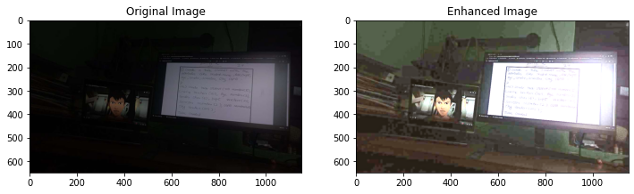
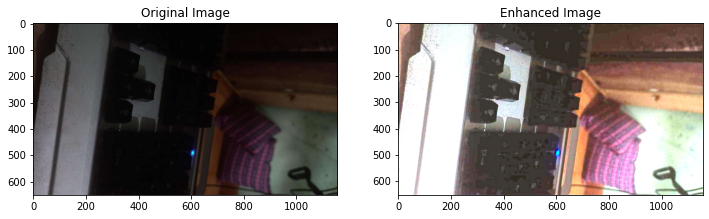
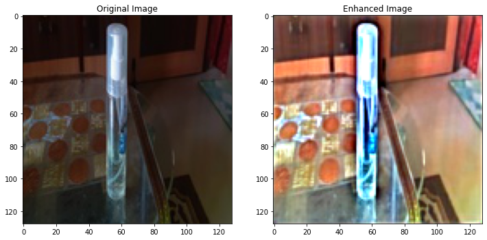
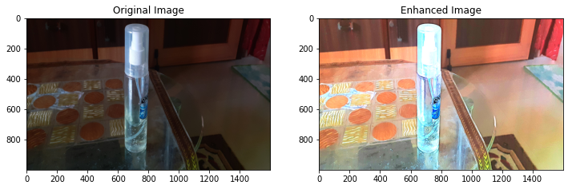
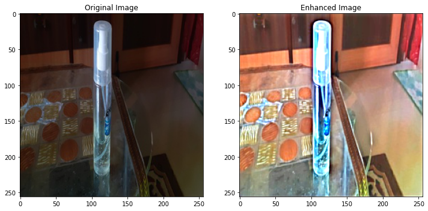

# Image-Enhancement

### Image Enhancement using MIRNet and Tensorflow 2.4.1

Reference Paper: https://arxiv.org/pdf/2003.06792v2.pdf  
Reference Repositry Link: https://github.com/soumik12345/MIRNet/

## Output I got

## Pull Request

Pull Requests are welcome. Please follow these rules for the ease of understanding:
* Make sure to check for available issues before raising one
* Give me a maximum of 24-48 hours to respond
* Have proper documentation on the parts you are changing/adding

## Developed & Maintained by

[👨 Sayan Nath](https://sayan-nath.web.app/)
[📷 Insta](https://www.instagram.com/sayannath235/)
[🐤 Twitter](https://twitter.com/SayanNa20204009)
[🧳 LinkedIn](https://www.linkedin.com/in/sayan-nath-15a989182/)

